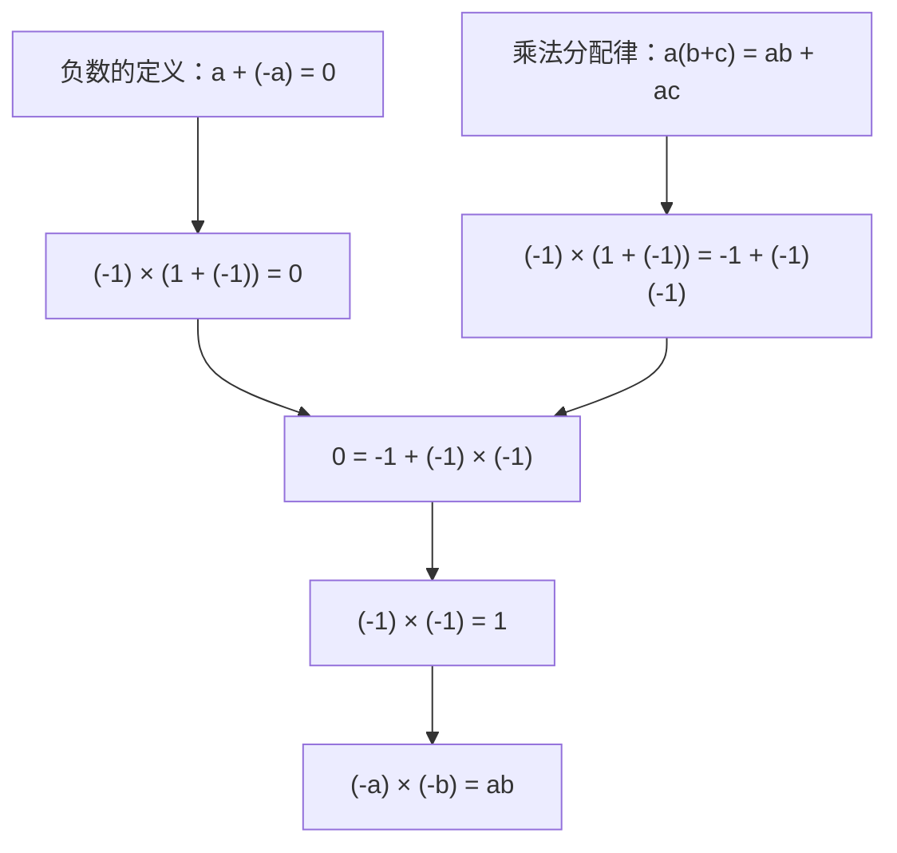

## 一句话

「负负得正」不是规定，而是被「乘法分配律 + 负数的定义」逼出来的唯一结果。

## 依赖图

## 关键要点

- **负数的定义**：$-a$ 就是「和 $a$ 相加得到 0 的那个数」，即 $a+(-a)=0$（加法逆元）。
- **分配律是硬约束**：$a(b+c)=ab+ac$ 对负数也必须成立，否则心算就崩。
- **核心技巧**：同一个式子 $(-1)\times(1+(-1))$ 走两条路——用定义得 $0$，用分配律得 $-1+x$——两条路必须相等，于是 $0=-1+x$，唯一解是 $x=1$。
- **直觉**：乘 $-1$ 是绕 0 翻身；乘两个负数翻两次，回到原地。
- **推广**：$(-a)(-b) = (-1)(-1)\,ab = ab$。

## 为什么是这样（发现路径）

1. 动机：把乘法从正数扩展到负数时，我们能随便规定 $(-1)\times(-1)$ 吗？
2. 不能——我们想保住分配律这条老规则。
3. 于是问：什么值能同时满足「分配律」和「负数的定义」？
4. 用 $(-1)\times(1+(-1))$ 两路计算，得到 $0 = -1 + (-1)(-1)$。
5. 唯一能解出的是 $(-1)(-1)=1$。是被逼的，不是选的。

## 易错点

- **别把它当「规定」背**。它是分配律的推论；只背「负负得正」而不知道来源，就锁不进脑图。
- **「任何数乘 0 等于 0」在推导里不算循环**：$a\times 0 = a\times(0+0)-a\times 0$ 可推出 $a\times 0 = 0$，不依赖负负得正，所以能放心用。
- **直觉 ≠ 证明**：「翻两次身」给感觉，严格的「必须如此」来自分配律那一步，二者别混。

## 自测

- [ ] 不看笔记，用分配律重推一遍 $(-1)\times(-1)=1$。
- [ ] 为什么 $(-1)\times 0 = 0$ 在推导里不算循环论证？
- [ ] 用同一招证明 $(-2)\times(-3)=6$。
