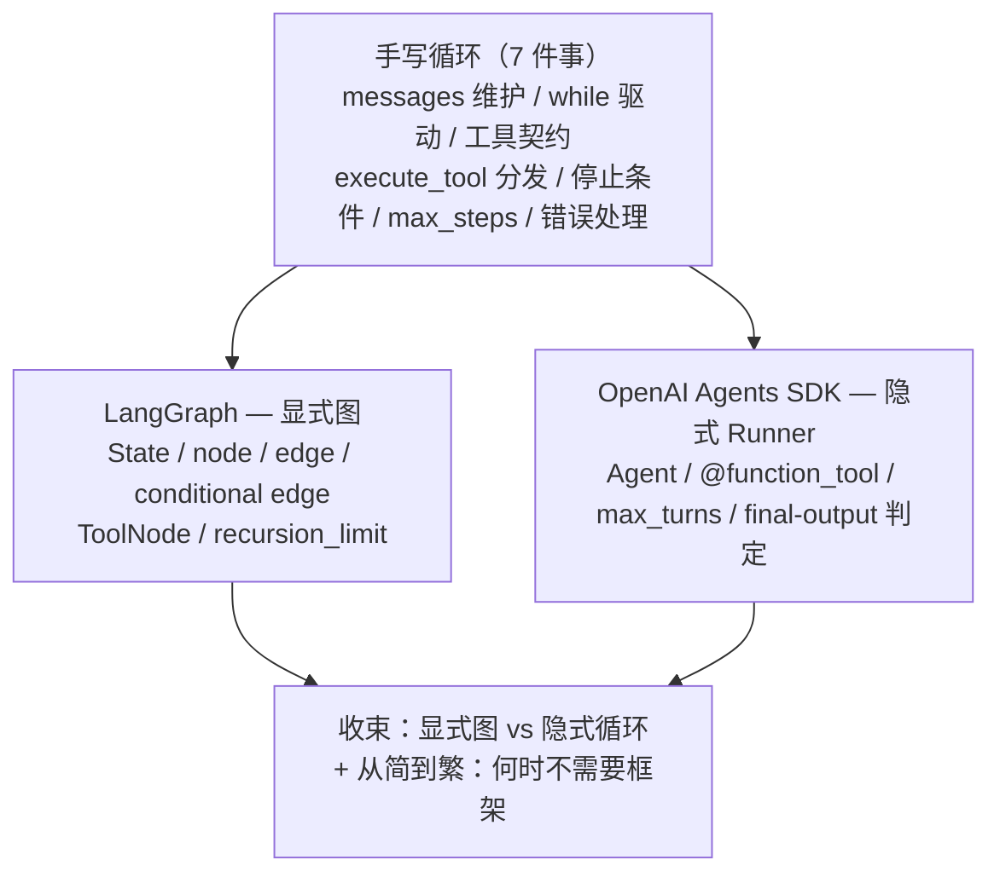

## 一句话

框架不是另一套东西，而是把你手写的那个「messages 列表 + while 循环 + tool_calls 判断 + execute_tool 分发器」**自动化 + 工程化**：LangGraph 把它画成显式图，OpenAI Agents SDK 把它藏进 `Runner`。

## 依赖图

## 关键要点

1. **框架 = 手写循环的自动化**：你手写的 7 件事（messages 维护、while 驱动、工具契约、execute_tool 分发、停止条件、max_steps、错误处理），框架逐行接管。
2. **LangGraph = 显式图**：循环从「代码里隐式的 while」变成「显式画的 node/edge」。`MessagesState`=messages、`ToolNode`=execute_tool、conditional edge 返回 `END`=break、`tools → agent` 的边=while 下一轮、`recursion_limit`=max_steps。价值在「循环变成图结构」后可可视化/checkpoint/回溯/插人工审批。
3. **Agents SDK = 隐式 Runner**：官方对 `Runner.run()` 内部循环的描述逐字就是你的 while（「执行工具、append 结果、重跑」）。`@function_tool` 从函数签名+docstring 自动生成契约，`max_turns`=max_steps。控制流从「模型选哪个工具/handoff」中涌现。
4. **框架多送的**：状态持久化/checkpoint、回溯、人工审批、流式、自动重试/超时、并行 fan-out、可观测性。
5. **代价**：抽象层遮蔽底层、锁定（Agents SDK 默认 OpenAI Responses API，DeepSeek 不兼容）、学习成本 + 诱使过度设计。
6. **决策 = 从简到繁**（Anthropic）：20 行循环 + 单模型 + 少量工具**不需要框架**；出现**具体可命名的痛点**（持久化/回溯/审批/多 agent 并行）时才引入，一个痛点对应一个框架能力。

## 为什么是这样（发现路径）

1. 手写完循环后问「框架凭什么存在」→ 答案不是魔法，是把 7 件重复劳动自动化。
2. LangGraph 回答「控制流谁来定」→ 你画图、你写死，适合精确多步 workflow。
3. Agents SDK 回答同一个问题相反 → Runner 替你跑、模型自己选路，适合开放 Agent。
4. 于是「用不用框架」变成「匹配问题」：地基（手写）够用就不上框架。

## 易错点

- **LangGraph 的 base_url 叫 `openai_api_base`**，不是 `base_url`（`ChatOpenAI` 字段名）。
- **DeepSeek 默认 thinking mode**：用 `ChatOpenAI(..., extra_body={"thinking": {"type": "disabled"}})` 关掉，否则带 tools 时 `reasoning_content` 必须回传、易 400。
- **Agents SDK 默认走 OpenAI Responses API**，DeepSeek（Chat Completions 兼容）用不了——这是「OpenAI-first」的代价；LangGraph 是 model-agnostic，能指到 DeepSeek。
- **LangGraph 1.x 里 `create_react_agent` 已弃用**，迁移到 `langchain.agents.create_agent`；`add_messages` 从 `langgraph.graph.message` 导入。

## 自测

- [ ] 不看书，能画出「手写循环 7 件事 → LangGraph」的逐行对照表？
- [ ] 能说出 LangGraph（显式图）和 Agents SDK（隐式 Runner）的根本区别及各自适用场景？
- [ ] 能回答「什么痛点出现时才值得用框架」并各举一个对应能力？

## 参考资料

- [LangGraph Graph API overview](https://docs.langchain.com/oss/python/langgraph/graph-api) —— StateGraph/node/edge/conditional edge/loop
- [LangGraph Quickstart](https://docs.langchain.com/oss/python/langgraph/quickstart) —— 最小 agent 五步结构
- [OpenAI Agents SDK Quickstart](https://openai.github.io/openai-agents-python/quickstart/) —— Agent/tool/Runner 最小代码
- [OpenAI Agents SDK: Running agents](https://openai.github.io/openai-agents-python/running_agents/) —— Runner 内部循环原文、max_turns、sessions
- [Anthropic: Building Effective Agents](https://www.anthropic.com/engineering/building-effective-agents) —— 「从简到繁」与何时用框架

> 练习代码：`practice/agent/05_langgraph.py`（LangGraph 版，指向 DeepSeek，已跑通）。
