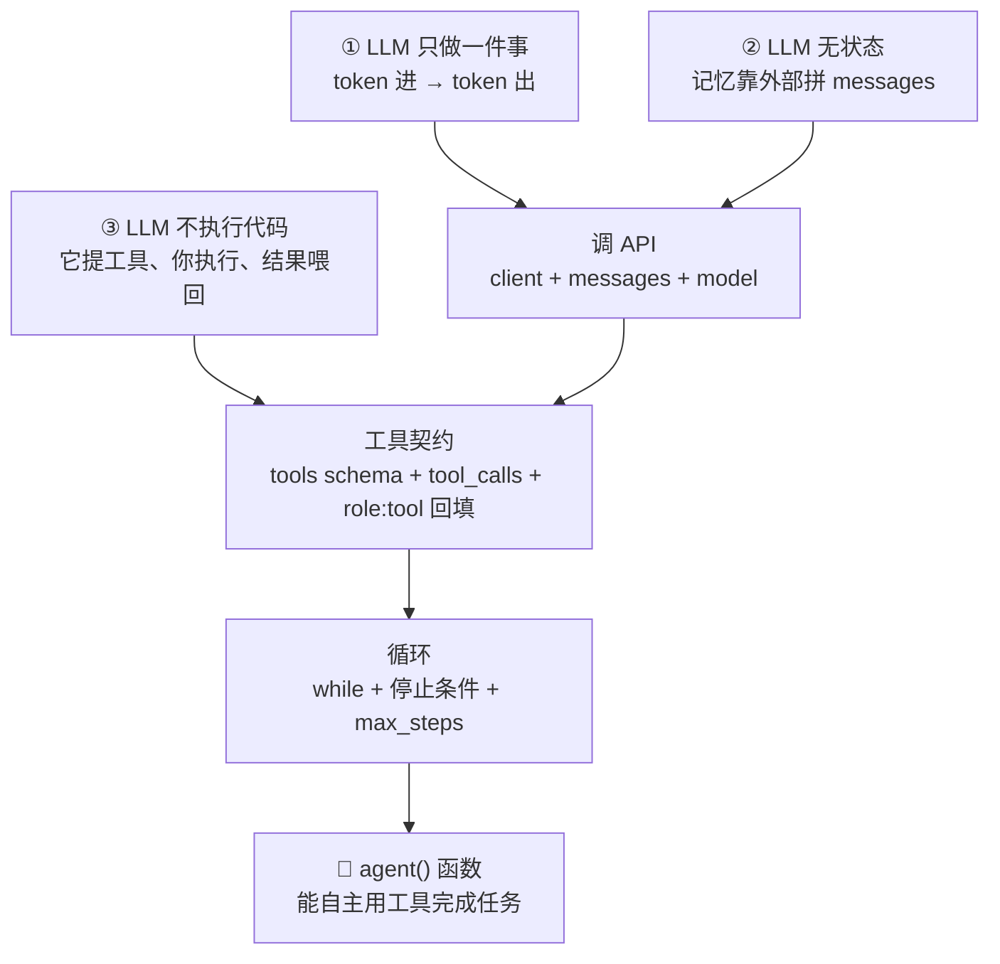

## 一句话

Agent 是一个**循环**：LLM 只负责「下一步该干嘛」的文本决策，而工具的执行、结果喂回、记忆、停止条件，全是你写的代码。模型给决策，代码给手脚。

## 依赖图

## 关键要点

1. **三条无条件真理**（地基）：① LLM 只做 token 进/出；② LLM 无状态，记忆 100% 来自你拼的 `messages`；③ LLM 不执行代码——工具调用是「它提、你执行、结果喂回」。
2. **一次最小调用 = key + messages + model**：`OpenAI(api_key, base_url)` 开门，`messages` 是上下文，`model` 指定算哪个。SDK 背后只是一条 HTTP POST + JSON。
3. **工具 = 契约**：你给的是 `name` + `description`（何时用）+ `parameters`（JSON Schema，参数及类型），**不是实现代码**。模型据此输出 `tool_calls`（一个结构化「提议」）。
4. **循环三要素**：`while/for`（循环）→ `if not msg.tool_calls: break`（停止条件，模型自己说做完了）→ `for call in msg.tool_calls`（执行 + 喂回）；外加 `max_steps` 保险丝。
5. **`agent()` 函数就是 Agent**：吃进一句话、吐出答案，中间自主决定用不用工具、用几次。框架里没有魔法，只是把这个循环加上记忆/错误处理/并行/多智能体的工程化包装。

## 为什么是这样（发现路径）

从「让模型说一句话」出发，每一步都由一个缺口推动：

1. 模型只会说话 → 问它天气它会瞎编（幻觉）→ 需要给它「手」。
2. 但 ③ 说它不能执行代码 → 于是发明了「契约」：模型输出「我想调 `get_weather(city="北京")`」，你的代码去执行，结果喂回。
3. 单次调用只能「调一次就答」→ 真实任务要多步（先查时间、再查天气）→ 把单次包成循环。
4. 循环散在脚本里写死一个问题 → 封装成 `agent(user_query)`，就成了可反复调用的 Agent。

## 易错点

- **忘记原样回填 assistant 的 `tool_calls` 消息**就追加 `role:"tool"` → 第二轮 400（`tool_call_id` 找不到对应调用）。头号新手坑。
- **`arguments` 是 JSON 字符串不是字典** → 要先 `json.loads()` 才能 `**args`。
- **用 `if` 而不是 `while`** → 只能处理一轮工具调用，多步任务直接断。
- **不加 `max_steps`** → 模型可能无限循环烧钱。
- **工具 `description` 太含糊** → 模型不知道「何时该用」，乱调或不调；要写「何时调用」的决策边界。
- **模型给的工具名/参数不可信** → `execute_tool` 分发器就是安全把关口，要校验。
- **DeepSeek 特有**：默认开 thinking mode（响应带 `reasoning_content`，带 tools 时必须原样回传，否则 400）；教学/简单场景用 `extra_body={"thinking":{"type":"disabled"}}` 关掉。模型名现为 `deepseek-flash`（旧 `deepseek-chat` 已退役）。

## 自测

- [ ] 不看书，能写出一个带 `get_weather` 工具的 `agent()` 循环，并说清每行对应哪条真理？
- [ ] 能解释「为什么模型给 `tool_calls` 后，你写的 `for` 循环是必须的」？
- [ ] 能说出「停止条件」和「max_steps」各自的角色？

## 参考资料

- [OpenAI Function calling 指南](https://developers.openai.com/api/docs/guides/function-calling) —— tool calling 机制与 schema
- [OpenAI cookbook: How to call functions with chat models](https://github.com/openai/openai-cookbook/blob/main/examples/How_to_call_functions_with_chat_models.ipynb) —— 手写最小闭环
- [DeepSeek Tool Calls 指南](https://api-docs.deepseek.com/guides/tool_calls/) —— DeepSeek function calling 示例与 thinking mode
- [DeepSeek Thinking Mode 指南](https://api-docs.deepseek.com/guides/thinking_mode) —— reasoning_content 回传规则
- [ReAct 论文 (arXiv:2210.03629)](https://arxiv.org/abs/2210.03629) —— 推理与行动交织的循环
- [alexsavio: First Principles — LLM Agents](https://alexsavio.github.io/first-principles-llm-agents.html) —— 第一性原理六条
- [Datawhale《从零开始构建智能体》(Hello-Agents)](https://datawhalechina.github.io/hello-agents/) —— 主教材（第 3/4/7 章手写 ReAct + 自研框架）
- [李博杰《深入理解 AI Agent》](https://bojieli.github.io/ai-agent-book/) —— 原理伴读（第 1-2 章入门级）
- [Wayland《AI Agent 架构》](https://waylandz.com/ai-agent-book/) —— 进阶 design patterns / 生产化

> 练习代码：`practice/agent/01_hello.py` → `02_tool_call.py` → `03_loop.py` → `04_agent.py`（逐步递进）。
