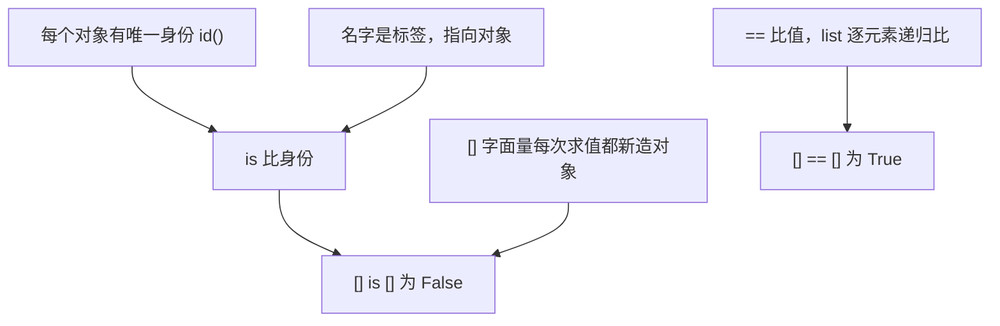

## 一句话

`==` 比的是**值**（内容是否一样），`is` 比的是**身份**（是不是同一个对象）；`[]` 字面量每次求值都新造一个列表，所以 `[] is []` 为 `False`，而两个空列表逐元素比较没有元素可不同，所以 `[] == []` 为 `True`。

## 依赖图

## 关键要点

- **两个不同的问题**：`is` 回答「是同一个对象吗」，`==` 回答「内容一样吗」。
- **对象有唯一身份**：`id()` 返回对象生命周期内的唯一编号；同一时刻两个不同对象 `id()` 必不同。
- **`[]` 是造对象，不是引用**：写一个列表字面量 = 调用一次「造新 list」，与元素个数无关。
- **list 的 `==` 逐元素递归**：两边都无元素时「没有位置可不同」→ 平凡相等。

## 为什么是这样（发现路径）

1. 你已经知道「变量是名字，赋值不复制」（aliasing），也拿 `id()` 当「原地改 vs 造新对象」的判据。
2. 这背后是一条更底层的真理：**每个对象在生命周期内有唯一身份**，`id()` 编号的就是这个实体。
3. 于是 Python 需要两个算子回答两个不同问题：`is`（同一个对象？）和 `==`（内容一样？）。
4. 而 `[]` 字面量遵循你已知的规则——「写列表字面量 = 造新对象」，只是元素个数为 0。
5. 拼起来：两次 `[]` 造出两个对象 → `is` 为 `False`；两个空列表逐元素比、没有元素可不同 → `==` 为 `True`。

## 易错点

- **别用 `is` 比不可变字面量**：CPython 缓存小整数（`-5..256`）与部分 intern 字符串，`256 is 256`、`'a' is 'a'` 常为 `True`，但这是实现细节、不是语言保证；跨编译单元时 `eval("257") is eval("257")` 就是 `False`。Python 3.8+ 对 `is` 接字面量直接 `SyntaxWarning`。**比值用 `==`，`is` 只比身份**（惯用法 `x is None`）。
- **`is` 不递归，`==` 递归**：`[1] is [1]` 为 `False`，但 `[1] == [1]` 为 `True`。
- **`[] is []` 为 `False` 不是因为空列表「不相等」**：它们 `==` 是相等的；是因为它们是两个不同对象。把「相等」和「同一个」分开。

## 自测

- [ ] `a = []; b = a; a is b` 是什么？为什么？
- [ ] `[1, [2]] == [1, [2]]` 是什么？`[1] is [1]` 呢？
- [ ] 为什么惯用法是 `x is None` 而不是 `x == None`？
- [ ] `256 is 256` 与 `eval("257") is eval("257")` 为什么一个 `True` 一个 `False`？

## 参考资料

- Python 官方文档 · Data model（对象、值与类型、`__eq__`）— https://docs.python.org/3/reference/datamodel.html —— 支撑「对象有唯一身份」与 `==` 的定义
- Python 官方文档 · Comparisons（`==`）— https://docs.python.org/3/reference/expressions.html#comparisons —— 支撑 list 逐元素 `==`
- Python 官方文档 · Identity comparisons（`is` / `is not`）— https://docs.python.org/3/reference/expressions.html#is —— 支撑 `is` 的定义
