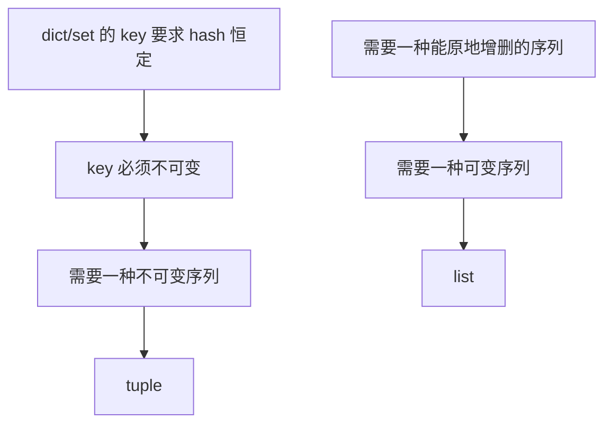

## 一句话

list 和 tuple 的区别，本质是 **Python 同时需要两种序列**：一种能原地增删（list），一种能当 dict/set 的 key（必须不可变，tuple）——这是被一条硬约束逼出来的设计选择，不是任意规定。

## 依赖图

## 关键要点

- **判据——"可变"是什么意思**：有"原地改对象本身"的操作（判据是 `id()` 不变）。list 有（`append`/`__setitem__`），tuple 没有。
- **不可变的后果**：tuple 只能"造新对象再重绑"，不能原地改。
- **为什么非得不可变**：`dict`/`set` 的 key 要求 hash 恒定。如果 key 能被原地改，hash 就变了，表结构直接崩。

## 为什么是这样（发现路径）

1. 先问：Python 为什么要同时提供两种"有序序列"？
2. 从一条硬约束出发：**dict/set 的 key 必须不可变**（否则 hash 不稳定）。
3. 于是必须有一种不可变序列 → tuple。
4. 但日常又极需要能增删的序列 → list。
5. 两个需求都不消失 → 两个类型。

## 易错点

- **"tuple 更快"是结果，不是原因**。它更快是因为不可变带来的布局/缓存优势，不是设计的动机。
- **tuple 里装 list，tuple 仍可哈希吗？** 不可以——只要元素里有可变对象，整个 tuple 就不可哈希（`TypeError`）。
- **变量是名字，赋值不复制**。`b = a; a.append(4)` 之后 `b` 也变了——这是 aliasing，和可变性相关但不同。

## 自测

- [ ] 判断一个类型是否可变，你的判据是什么？
- [ ] 为什么 dict 的 key 不能是 list？
- [ ] `(1, [2])` 能当 dict 的 key 吗？为什么？
